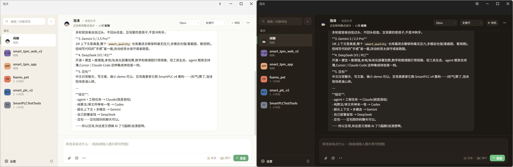
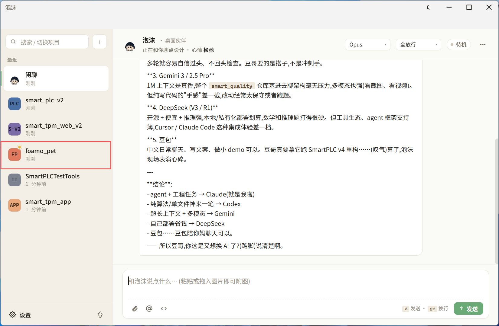
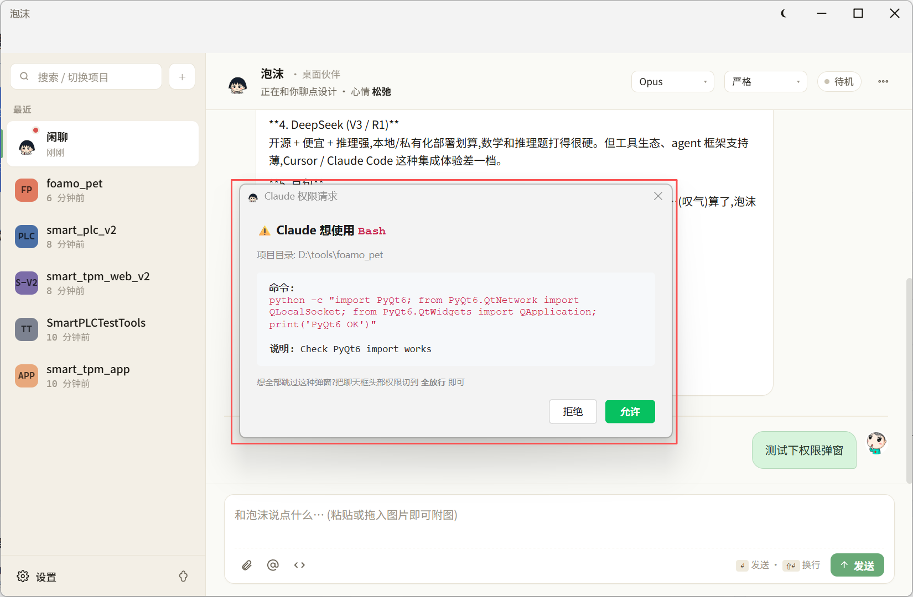
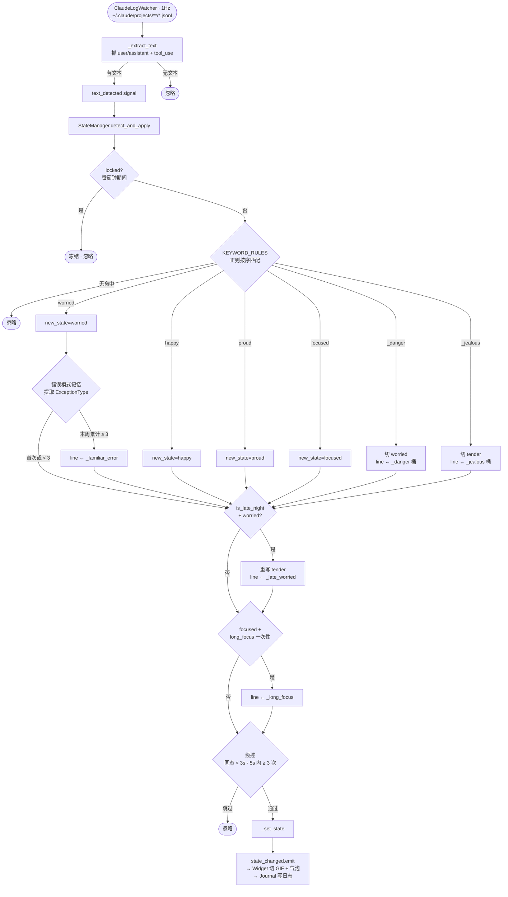
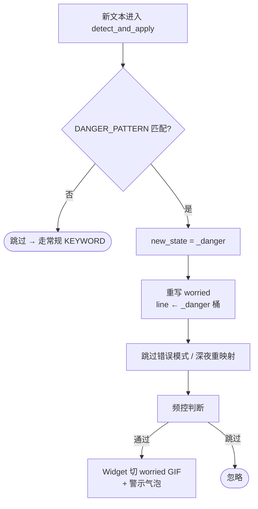
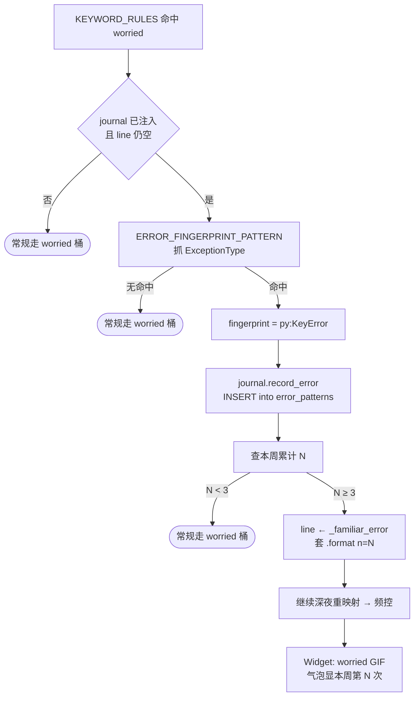
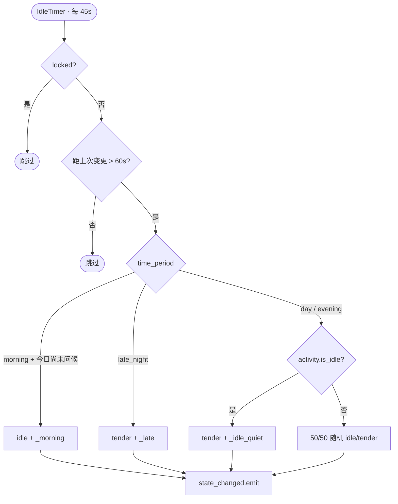
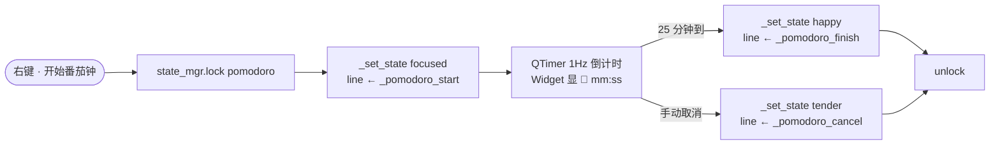
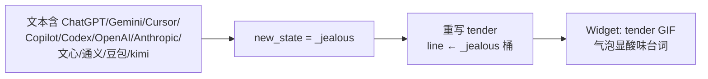
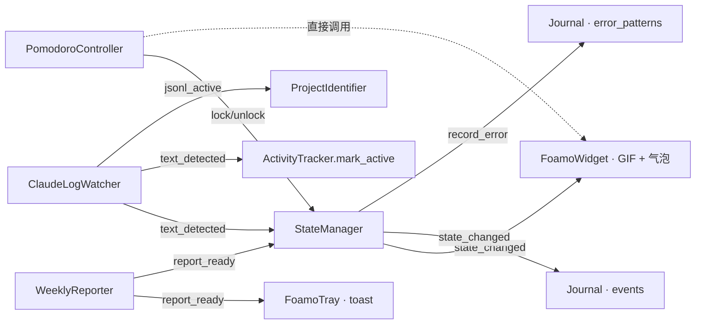

<div align="center">


# Claude Pet

**桌面悬浮的 Claude Code 陪伴 — 不打开 IDE 就能让 AI 改代码**

[](LICENSE)
[](https://www.python.org)
[](#-平台兼容)
[](https://github.com/zhangdoudougit/claude-pet/stargazers)
[](https://github.com/zhangdoudougit/claude-pet/commits)

<video src="https://github.com/user-attachments/assets/4b8c9271-be49-4987-99db-1b8243506eeb" controls width="800"></video>

<sub>🎬 桌宠陪伴 + 聊天面板 + 项目模式 + 权限弹窗的全流程</sub>

</div>

---

## ✨ 这是什么

一个本地运行的 **PyQt6 桌面悬浮宠物**,把 [Claude Code](https://docs.claude.com/en/docs/claude-code/overview) 搬到你显示器右下角。两个独立但联动的能力:

1. **被动陪伴** —— 监听 `~/.claude/projects/*.jsonl`,根据你和 Claude Code 的对话关键词自动切换状态(担心 / 活泼 / 专注 / 得意),不发任何东西到 API。
2. **主动聊天** —— 桌宠双击呼出聊天面板,通过 `claude -p` 子进程跟 Claude Code 对话。**支持选定项目目录直接改代码**,不必打开 VSCode。**支持接入 DeepSeek / GLM / Kimi 等国内模型** 走国产替代(见 [🌐 接入第三方模型](#-接入第三方模型))。

```
┌─────────────────────────────────────┐         ┌──────┐
│  聊天面板          严格 ▾  会话 ▾  ×  │         │      │
├─────────────────────────────────────┤         │      │
│ [你] 帮我读下 README.md 然后…       │         │ 桌宠 │
│                                     │         │      │
│ [⚙ Read][⚙ Read ✓]                  │         │      │
│ [AI] 看完了, 主要分三块…             │ ← 跟随 → │      │
└─────────────────────────────────────┘         └──────┘
```

> _项目名 `claude-pet`,桌宠角色 **泡沫 / foamo**(小丸子)。_

---

## 🌟 主要特性

### 🐾 桌宠本体

- 280×280 悬浮窗 + 系统托盘集成,支持多屏拖动 / 扒屏边探头
- 6 种状态对应 6 张 GIF(`idle / tender / focused / happy / worried / proud`)
- 关键词触发:`error → 担心`,`done → 活泼`,`git push → 专注`,等等
- 番茄钟、本周功劳簿(自动统计)
- 拖动会抖动 + 冒台词,扒到屏幕边会"探头"
- 可选 Live2D 立绘(放进 `assets_live2d/<角色名>/`)

### 💬 聊天面板

- **微信样式气泡** + Markdown 渲染 + 代码块高亮
- **Win11 Mica / Win10 Acrylic / 其他平台 Opacity** 三级毛玻璃自动降级
- **Spinner 思考动画**,先出头像再流式填内容
- **工具调用 chip**:连续工具压成一行胶囊,点击展开看 input + result
- **用户头像**自定义(`.chat_state/avatars/user.{png,jpg,...}`)
- **8 方向边缘拖拽**调大小



### 🎨 视觉系统 (v1.6)

聊天面板基于 Claude Design 输出重做了一版:

- **自绘 Win11 风 chrome**:32px 标题栏(icon + ☀/🌙 主题切换 + min/max/close)
- **双主题切换**:暖白克制版(浅色,沉静薄荷绿 accent) ↔ 暗色玻璃版(深色,青蓝 accent),持久化到 `.chat_state/theme`
- **侧栏重做**:暖色底,卡片白底 + 左侧 3px accent 竖条(选中态),二级行显示项目最近活动
- **StatusPill**:待机(灰) / 思考中(黄, 脉冲) / 在线(绿)
- **Composer 升级**:圆角卡片 + 工具行(📎 @ </>)+ 快捷键提示(↵ / ⇧↵)+ 主色实心发送按钮

### 🗂 多项目并发 (v1.5)

聊天面板从"贴桌宠的小窗"升级为独立的微信式一体窗。

| 区域 | 说明 |
|---|---|
| **左侧侧栏 (240px)** | 闲聊永远置顶,项目按最近活跃排序 |
| **右侧主区** | 当前选中卡片的对话气泡区 + 输入框 |
| **顶栏 +** | 添加项目:选目录 → 自定义简码 → 选 8 色之一 |

每张卡片对应一个独立的 `claude` 子进程,切换不打断后台对话。角标用三色单点表达状态:

- 🟡 **黄(脉冲)**:后台正在思考
- 🔴 **红(微闪)**:后台触发了权限请求,等你确认
- 🔵 **蓝(静态)**:后台回完了,你还没看

切到对应卡片时角标会自动清空。



### 📁 项目模式

- 会话菜单选 **[选择项目目录...]** → claude 的 cwd 切到该项目
- 让 claude 直接读 / 改代码,跟在 VSCode 里跑 `claude` 一样
- 每个项目**独立 session 和 history**,切回来能续聊

### 🔒 权限管理

- 头部下拉:**严格 / 自动接受改动 / 全放行(危险)**
- `PreToolUse` hook 配 PyQt6 弹窗:Claude 想用 Bash/Edit/Write 等会先弹确认
- 白名单跳过 Read/Glob 等纯读工具,不刷屏
- 只对聊天框启动的 claude 生效,**不污染** `~/.claude/settings.json`



### 🌏 国内可用

- 代理透传:`.chat_state/proxy` 文件 / 环境变量 `HTTPS_PROXY`
- 所有依赖能离线装(只需 `PyQt6`)

---

## 🏗 Architecture


完整状态机文档见 [`STATE_FLOW.html`](STATE_FLOW.html)(浏览器打开)。

---

## 🎯 状态机 & 触发规则

桌宠不会调任何 API,所有"情绪"切换都来自**本地监听** `~/.claude/projects/**/*.jsonl` —— Claude Code 自己写在那儿的对话流。

### 6 个主状态

| 状态 | 中文 | 光晕主色 | 默认台词风格 |
|---|---|---|---|
| `idle` | 陪伴态 | <code>#b39ddb</code>(淡紫) | 默默在线,偶尔冒一句 |
| `tender` | 温柔态 | <code>#b39ddb</code>(淡紫) | "累了就歇会儿" "别熬太晚" |
| `focused` | 专注态 | <code>#4dd0e1</code>(青蓝) | "嘘,别打扰" "稳住稳住" |
| `happy` | 活泼态 | <code>#ff7eb6</code>(粉) | "搞定啦~" "本泡沫真厉害" |
| `worried` | 担心态 | <code>#ffb74d</code>(琥珀) | "出什么事了" "一起想办法" |
| `proud` | 得意态 | <code>#ffd54f</code>(金黄) | "小事一桩" "记得是谁陪你" |

每个状态都有 5-7 句备选台词,触发时随机抽一句冒在气泡里(配置在 `claude_pet.py` 的 `LINES` 字典)。

### 关键词触发规则

监听到新对话 → 跑正则 → 第一条匹配的规则生效:

| 触发 | 正则关键词 | 状态 / 效果 |
|---|---|---|
| **危险命令** | `rm -rf` / `git push --force` / `git reset --hard` / `DROP TABLE` / `DELETE ... (无 WHERE)` / `shutdown` / `mkfs` / `dd if=` / `--no-verify` | → `worried` + 哨兵台词("这个不可逆的","看一眼路径再回车") |
| **提到别的 AI** | `ChatGPT` / `GPT-4` / `Gemini` / `Cursor` / `Copilot` / `Codex` / `豆包` / `通义` / `kimi` ... | → `tender` + 占有欲彩蛋台词("哼,问就问","他能比本泡沫更懂...") |
| **错误信号** | `error` / `exception` / `traceback` / `报错` / `崩溃` / `failed` / `null reference` / `NaN` / `panic` / `fatal` | → `worried` |
| **完成信号** | `✅` / `搞定` / `完成` / `成功` / `passed` / `fixed` / `solved` / `works` / `可以了` / `all tests pass` | → `happy` |
| **被夸** | `谢谢` / `thanks` / `awesome` / `nice job` / `不错` / `厉害` / `nb` / `牛` / `完美` / `excellent` | → `proud` |
| **工作信号** | `bug` / `debug` / `调试` / `分析` / `诊断` / `排查` / `测试` / `review` / `为什么` / `git commit/push/pull/merge/rebase` | → `focused` |

> 规则顺序就是优先级。前面的命中后不再往下走 —— 比如"`git push --force` 修了 bug" 会先撞 `_danger`(危险命令),不会被 `happy` 截到。

### 上下文事件(不靠关键词,靠时间 / 节奏)

| 事件 | 触发条件 | 表现 |
|---|---|---|
| **凌晨问候** | 本地时间 ≥ 02:00 | 切 `tender` + "...都几点了豆哥" 类台词 |
| **早起问候** | 启动时 06:00-10:00 | 切 `idle` + "豆哥早呀~" |
| **长时间专注** | 同一状态持续 60 分钟 | 不切状态,冒"水。" / "肩膀。靠在椅背一下" |
| **闲置安静** | 长时间无输入 | 冒省略号 / "(在的)" |
| **同类错本周复发** | 同一 `ExceptionType` 在 7 天内 ≥3 次 | 切 `worried` + "...这熟悉的味道,本周第 N 次了" |
| **番茄钟开始 / 完成 / 取消** | 用户从托盘 / 右键启动 | 切 `focused` + 三档专属台词 |

### 改触发规则 / 台词

`claude_pet.py` 顶部三个常量,改完保存即可,运行中会自动 reload:

- `LINES`(各状态台词列表 + `_late` / `_jealous` / `_danger` 等上下文台词组)
- `KEYWORD_RULES`(正则 → 状态映射,**顺序就是优先级**)
- `STATE_COLORS`(状态光晕色,`(亮色, 暗色)` 元组)

完整数据流见 [`STATE_FLOW.html`](STATE_FLOW.html)。

---

## 🎭 Live2D 立绘(可选)

不喜欢 GIF?把 Live2D 模型扔进去,桌宠会变成会眨眼、会呼吸、眼神跟鼠标走的立绘。GIF 模式和 Live2D 模式可以**右键菜单随时切**,互不影响。

### 加载模型

```
assets_live2d/
├── 魔女/
│   ├── 魔女.model3.json
│   ├── 魔女.moc3
│   ├── textures/
│   ├── motions/        *.motion3.json
│   └── expressions/    *.exp3.json
└── <你的角色>/
    └── ...
```

启动后右键托盘 → **角色** → 选要的模型。程序自动扫 `assets_live2d/**/*.model3.json`,无需配置。

### 自动补全 model3.json

VTube Studio 导出的素材**经常**漏写 `FileReferences.Motions` / `FileReferences.Expressions`,Cubism SDK 加载后只会眨眼,不会用表情和动作。

程序检测到这种情况会**扫同目录的 `*.motion3.json` / `*.exp3.json`**,生成一份补全版 `<name>_foamo.model3.json` 副本喂给 SDK(原文件不改)。

### 状态 → 表情映射

桌宠状态变化时自动切表情。映射按"模型路径关键字"匹配,内置一个"魔女"模型示例:

```python
# live2d_canvas.py 顶部
STATE_EXPRESSION_PRESETS = {
    "魔女": {                # 模型路径含"魔女"就走这套
        "idle":    "hdj",   # 默认表情
        "tender":  "x",     # 爱心 — 温柔
        "focused": "yj",    # 戴眼镜 — 专注
        "happy":   "xx",    # 星星眼 — 雀跃
        "worried": "ku",    # 哭 — 担心
        "proud":   "fz",    # 法杖 — 邀功
        "jealous": "sq",    # 生气 — 占有欲
    },
}
```

加新模型只需添加一行(关键字 + 6 个表情 ID 映射)。没匹配上的模型走"随机表情"兜底,不会崩。

### 穿搭(Part 显隐)

右键菜单 → **穿搭模式** → 点击立绘任意服饰部位 → 切显/隐:

| 组 | 包含 | 关键字匹配 |
|---|---|---|
| 帽子 | 主体 + 装饰 + 后边 + 旋转壳 等所有"帽"part | `帽` |
| 上衣 | 衣服 + 胸口 + 蝴蝶结 | `上衣` / `衣服` / `胸口` / `蝴蝶结` |
| 裙子 | 短裙 + 裙撑 + 左右裙片 | `裙` |
| 袜子 | 左右袜 + 各图层版本 | `袜` / `丝` |
| 鞋子 | 左右鞋 / 靴 | `鞋` / `靴` |

**按 group 聚合**:点一下"帽子"会同时切走所有相关 part(主体、装饰、后边、蒙皮、旋转壳……),不会出现"切到一半穿在头上的怪图"。

腿 / 手 / 头 / 眼 / 嘴 是身体本体,**不在穿搭组里**,切不到(避免一不小心切掉皮肤)。

切完会持久化,下次启动复原。

### 面捕(实验)

接 [mediapipe](https://google.github.io/mediapipe/) blendshapes,把摄像头读到的脸映射到 Cubism Param:

- **头部姿态**:`yaw / pitch / roll` → `ParamAngleX / Y / Z` + 弱化的 `BodyX`
- **眼睛眨**:`eyeBlinkLeft / Right` → `ParamEyeLOpen / ROpen`(自动眨眼会关掉,避免打架)
- **眼球瞟向**:`eyeLookOut/In Left/Right` 综合算 X/Y → `ParamEyeBallX / Y`
- **嘴**:`jawOpen` → `MouthOpenY`,`mouthSmile - mouthFrown` → `MouthForm`
- **眉毛**:`browInnerUp - browDown(Left/Right)` → `ParamBrowLY / RY`(没 BrowRY 的模型用平均值兼任)

参数名按模型实际暴露的 `ParamId` 自动 resolve(VTube Studio 导出多为 `PARAM_ANGLE_X` 大写蛇形,Cubism 原生为 `ParamAngleX`,都兼容)。

### 静态姿态原则

**默认不自动循环 Idle motion**(motion 循环会让模型一直晃,举法杖 / 摇头,跟 GIF 那种"定格姿态"对比起来反而不稳定)。立绘默认只:

- 自动眨眼 + 自动呼吸(SDK 内置)
- 眼神跟鼠标(Drag 接口)
- 鼠标透传给父 widget(不影响拖动)

想看 motion 表演?右键菜单手动触发对应 group。

---

## 📊 状态机详图

> 这部分是 [`STATE_FLOW.html`](STATE_FLOW.html) 的 Markdown 镜像 —— GitHub 原生渲染 Mermaid,直接看;想看暗色主题 + 完整台词桶版本,本地浏览器打开 `STATE_FLOW.html`。

### 1. 主路径:jsonl 增量 → `state_changed`

每秒轮询所有 jsonl 文件大小,只读新增文本;提取 user / assistant 消息后送入状态机做**三层处理**:关键词 → 上下文重映射 → 频控。



### 2. 危险命令哨兵(`_danger`)

监听 assistant 工具调用里的命令字符串;命中即切 `worried` + 警示台词。优先级**最高**,在 `_jealous` 之前匹配。**不真拦截,仅本地反应**。



匹配的命令模式:`rm -rf` · `git reset --hard` · `git push --force / -f` · `git clean -fdx` · `DROP TABLE / DATABASE` · `TRUNCATE TABLE` · `DELETE FROM ... 无 WHERE` · `shutdown -h / reboot` · `mkfs.* / dd if=` · `--no-verify`(跳 hook)

### 3. 错误模式记忆(`_familiar_error`)

命中 `worried` 时,从文本抓 `ExceptionType`(`KeyError` / `TypeError` / ...)写入 SQLite,同一指纹**本周累计 ≥3 次**时,把台词换成"老朋友又来了"风格的吐槽。



**SQLite Schema**:

```sql
CREATE TABLE error_patterns (
  id INTEGER PRIMARY KEY AUTOINCREMENT,
  ts INTEGER NOT NULL,
  fingerprint TEXT NOT NULL,
  project TEXT
);
CREATE INDEX idx_err_fp_ts ON error_patterns(fingerprint, ts);
```

### 4. 副路径:安静期闲聊(`IdleTimer 45s`)

没有外部触发也会自言自语。距上次状态变更 **60s 以上**才动嘴。



### 5. 番茄钟旁路(`PomodoroController`)

右键启动后状态机 lock 25 分钟,期间所有 `detect_and_apply` 输入**直接丢弃**,Widget 持续显倒计时。



### 6. 占有欲彩蛋(`_jealous`)

豆哥在会话里提到别家 AI,泡沫切 `tender` + 酸味台词。是种**克制的小情绪**。



### 7. 关键参数 / 信号流

| 参数 | 值 | 含义 |
|---|---|---|
| `MIN_STATE_HOLD` | 3.0 s | 同状态最小保持时间 |
| `MAX_STATE_CHANGES_5S` | 3 | 5s 内最多状态切换次数 |
| 闲聊周期 | 45 s | IdleTimer 触发频率 |
| 闲聊门槛 | 60 s | 距上次状态变更需 >60s 才闲聊 |
| `POMODORO_DURATION_S` | 25 min | 番茄钟时长 |
| Watcher 轮询 | 1 Hz | jsonl 增量扫描间隔 |
| `LONG_FOCUS_SECONDS` | 60 min | 触发 `_long_focus` 的连续活动阈值 |
| `IDLE_THRESHOLD_SECONDS` | 30 min | `activity.is_idle` 阈值 |
| 错误模式阈值 | 3 次/周 | 命中 `_familiar_error` 改写台词 |



> _泡沫的内核 · 由 jsonl 喂养 · 由 SQLite 记忆_

---

## 📦 前置要求

- **Python 3.10+**
- **[Claude Code](https://docs.claude.com/en/docs/claude-code/quickstart)** 已安装并登录(`claude --version` 能跑)
- 国内用户:能跑通 Anthropic API 的代理 / 中转

---

## 🚀 Quick Start

### Windows

```bash
git clone https://github.com/zhangdoudougit/claude-pet.git
cd claude-pet
start.bat            # 首次自动 pip install PyQt6
```

不想看 cmd 黑窗:`start_silent.bat`(开机自启可以用这个)。
想要桌面快捷方式:`powershell -ExecutionPolicy Bypass -File install_shortcut.ps1`。

### macOS / Linux

```bash
git clone https://github.com/zhangdoudougit/claude-pet.git
cd claude-pet
pip install -r requirements.txt
python claude_pet.py
```

> macOS / Linux 没有 Mica/Acrylic,聊天面板会自动降级到半透明窗口(`opacity 0.96`),功能不受影响。

---

## 🌐 国内代理配置

第一次跑聊天框前,把代理写到 `.chat_state/proxy`(一行 URL):

```
http://127.0.0.1:7897
```

> 优先级:`.chat_state/proxy` > 环境变量 `HTTPS_PROXY` / `HTTP_PROXY`。
> 不需要代理就别建这个文件,代码会跳过注入。

---

## 🌐 接入第三方模型

> 走不通官方 Opus / Sonnet?DeepSeek / 智谱 GLM / Kimi 这类国内模型也能接。

原理:`claude` CLI 认 **`ANTHROPIC_BASE_URL`** 和 **`ANTHROPIC_AUTH_TOKEN`** 两个环境变量,指到任何 Anthropic 兼容的网关(国产模型官方的 Anthropic 端点 / `claude-code-router` / LiteLLM …)即可。Claude Pet 把这套配置封到 `.chat_state/env.json`,发消息时**只注入到自己起的 `claude` 子进程**,不污染系统级用法。

### 怎么用

1. 聊天框打开 → 左下 **「设置」** → **🌐 模型 / API** tab
2. 点 **「插入示例 ▾」** 选 preset:
   - DeepSeek 官方 Anthropic 端点
   - 智谱 GLM
   - Kimi(Moonshot)
   - claude-code-router 本地代理
   - LiteLLM 本地代理
3. 把模板里 `sk-你的-xxx-key` 改成真 token
4. **「保存」** → JSON 校验通过后立即生效,直接发消息

### 配置文件长这样

`.chat_state/env.json`:

```json
{
  "ANTHROPIC_BASE_URL": "https://api.deepseek.com/anthropic",
  "ANTHROPIC_AUTH_TOKEN": "sk-xxxxxxxx",
  "ANTHROPIC_MODEL": "deepseek-chat",
  "HTTPS_PROXY": ""
}
```

- `value` 写 **空串 `""` 或 `null`** 表示从环境变量里删除该 key(典型用法:`"HTTPS_PROXY": ""` 走国内网关时清掉代理)
- **只影响 foamo 自己**,系统里其他 `claude` 调用不受干扰
- 想回到官方:Settings 里 **「清空」** 或直接删 `.chat_state/env.json`

### 模型 ID 怎么定

`claude` CLI 看 `--model` 优先,没传才读 `ANTHROPIC_MODEL`。两种用法:

- **env.json 里写 `ANTHROPIC_MODEL`** → 顶栏"模型"下拉保持 **「默认」**,所有会话走 env.json 的模型
- **顶栏选「自定义…」填模型 ID** → 覆盖 env.json,**每个会话独立**记住

> 想要某个会话临时换模型?用第二种,不影响别的会话。

---

## 🎮 使用

### 桌宠操作

| 操作 | 效果 |
|---|---|
| **左键拖动** | 移动位置(会记住,跨屏可拖) |
| **双击** | 开 / 关聊天面板 |
| **右键** | 菜单(番茄钟、切状态、聊天、置顶、退出) |
| **托盘图标** | 单击显示桌宠,右键完整菜单 |

### 聊天面板

| 区域 | 说明 |
|---|---|
| **头部** | `[严格 ▾]` 权限 · `[会话 ▾]` 模式切换 · `×` 关闭 |
| **气泡区** | 微信式上下气泡,助手回复支持 ```code``` 代码块 |
| **输入区** | Enter 发送 · Shift+Enter 换行 · Esc 关面板 |
| **边缘** | 八方向拖拉调大小 |

### 项目模式

`会话 ▾` → `📁 选择项目目录...` → 选你想改的项目 → 标题切到 "**<项目名>**" → 直接说 "读 README.md / 改 main.py 第 30 行"。

每个项目独立 session 和 history,切回来能续聊。

### 权限模式

| 模式 | 行为 |
|---|---|
| **严格** | Bash / Edit / Write 等敏感工具弹 PyQt6 确认窗,Read / Glob 纯读放行 |
| **自动接受改动** | Edit / Write 类放行,Bash 仍弹 |
| **全放行** | 危险!Claude 可以无确认跑任何命令。只在你完全信任当前项目时用 |

---

## ❓ FAQ

**Q: 国内没代理能跑吗?**

Claude Code CLI 自己需要能通 Anthropic API。如果直连不通,需要配代理(见上面 [国内代理配置](#-国内代理配置))。Claude Pet 本身只是壳子,不直接调 API——代理给到 `claude` 子进程就行。

**Q: 权限弹窗一直弹很烦,怎么改?**

三档可选,聊天面板头部下拉切换:
- **严格**(默认):Bash / Edit / Write 等敏感工具都弹
- **自动接受改动**:Edit / Write 放行,Bash 仍弹
- **全放行**:都不弹(危险,只在你信任当前项目时用)

如果想永久跳过特定工具,改 `permission_dialog.py` 顶部的 `SKIP_TOOLS` 白名单。

**Q: 多个项目同时跑,资源占用如何?**

每个项目对应独立 `claude` 子进程,idle 时大约 30~50MB / 进程。建议同时打开不超过 5~6 个。切换面板不打断后台对话,后台跑完会用蓝色角标提示"有未读"。

**Q: macOS / Linux 毛玻璃为什么没生效?**

Mica / Acrylic 是 Windows 独占 API。其他平台自动降级到 opacity 0.96 的半透明窗口,功能完整,只是没有原生模糊效果。

**Q: 怎么完全卸载 / 清空数据?**

删项目目录 + 清三处本地数据:

```bash
# 1. 项目根目录下的会话状态(代理/历史/项目列表)
rm -rf claude-pet/.chat_state/

# 2. 番茄钟和周报数据库
rm -rf ~/.foamo_pet/

# 3. Windows QSettings 注册表(可选)
# 注册表路径: HKCU\Software\DogeFoamo\Claude Pet
# macOS:    ~/Library/Preferences/com.DogeFoamo.Claude Pet.plist
```

**Q: 想换桌宠形象怎么办?**

两种方式:
- **简单**:替换 `assets/` 下 6 张状态 GIF(`idle / tender / focused / happy / worried / proud`),程序会自动 reload
- **Live2D**:把模型(含 `.model3.json` + `.moc3` + 贴图)放到 `assets_live2d/<角色名>/`,启动后在右键菜单选

详见 [`REPLACE_ASSETS.md`](REPLACE_ASSETS.md)。

---

## 🖥 平台兼容

| 平台 | 桌宠 | 聊天面板 | 毛玻璃 |
|---|---|---|---|
| Windows 11 | ✅ | ✅ | ✅ Mica |
| Windows 10 | ✅ | ✅ | ✅ Acrylic |
| macOS | ✅ | ✅ | Opacity (无原生模糊) |
| Linux | ✅ | ✅ | Opacity |

---

## 🛠 自定义

| 你想改 | 改哪儿 | 详情 |
|---|---|---|
| **关键词触发 / 状态台词 / 光晕色** | `claude_pet.py` 顶部 | 见上面 [🎯 状态机 & 触发规则 → 改触发规则 / 台词](#改触发规则--台词) |
| **桌宠 GIF / Live2D 资源** | `assets/` 或 `assets_live2d/<角色>/` | 见上面 [🎭 Live2D 立绘](#-live2d-立绘可选) / [`REPLACE_ASSETS.md`](REPLACE_ASSETS.md) |
| **状态 → Live2D 表情映射** | `live2d_canvas.py` 的 `STATE_EXPRESSION_PRESETS` | 新模型加一行 (关键字 + 6 个 expression ID) |
| **权限白名单 / 弹窗策略** | `permission_dialog.py` 顶部 `SKIP_TOOLS` | 默认放行 `Read / Glob / Grep / LS / NotebookRead / TodoWrite/Read` |
| **MCP server / 自定义工具** | `mcp_manager.py` 或 Settings → 🔌 MCP 服务器 | 注册后聊天面板自动识别 |
| **第三方模型 / API endpoint** | `.chat_state/env.json` 或 Settings → 🌐 模型 / API | 见上面 [🌐 接入第三方模型](#-接入第三方模型) |
| **聊天面板配色** | `.chat_state/theme` + `web/app.css` | 双主题:WARM(暖白) / GLASS(暗) |

---

## 🗺 路线图

- [ ] 多角色皮肤一键切换(`assets/<角色>/...`)
- [ ] 一键生成 PyInstaller exe
- [ ] 工具调用 chip 加 Bash 命令的语法高亮
- [ ] 权限"本会话允许"持久化
- [ ] 聊天面板移动端响应式
- [ ] 国际化(英文 README + i18n string table)

---

## 🤝 贡献

PR 欢迎,详细规则见 [CONTRIBUTING.md](CONTRIBUTING.md)。

提 bug 请贴:
- `.chat_state/debug.log` 末尾若干行
- 平台 + Python 版本
- 复现步骤

---

## 📜 License

代码 [MIT](LICENSE) © 2026 zhangdoudougit。

> 桌宠角色 **泡沫 / foamo**(小丸子)由豆哥本人塑造,角色形象和台词版权保留,**fork 项目时角色可替换为你自己的**(`assets/` GIF 换掉即可)。

---

## 🙏 致谢

- [Claude Code](https://docs.claude.com/en/docs/claude-code/overview) —— 这个项目的对面那一半
- [PyQt6 FlowLayout 示例](https://doc.qt.io/qt-6/qtwidgets-layouts-flowlayout-example.html) —— 工具 chip 排版灵感
- [Shields.io](https://shields.io)、[Mermaid](https://mermaid.js.org/) —— README 美化
- 在角落里探头的本泡沫

---

<div align="center">

_本泡沫已上线 · 豆哥晚上好_ 🫧

</div>
