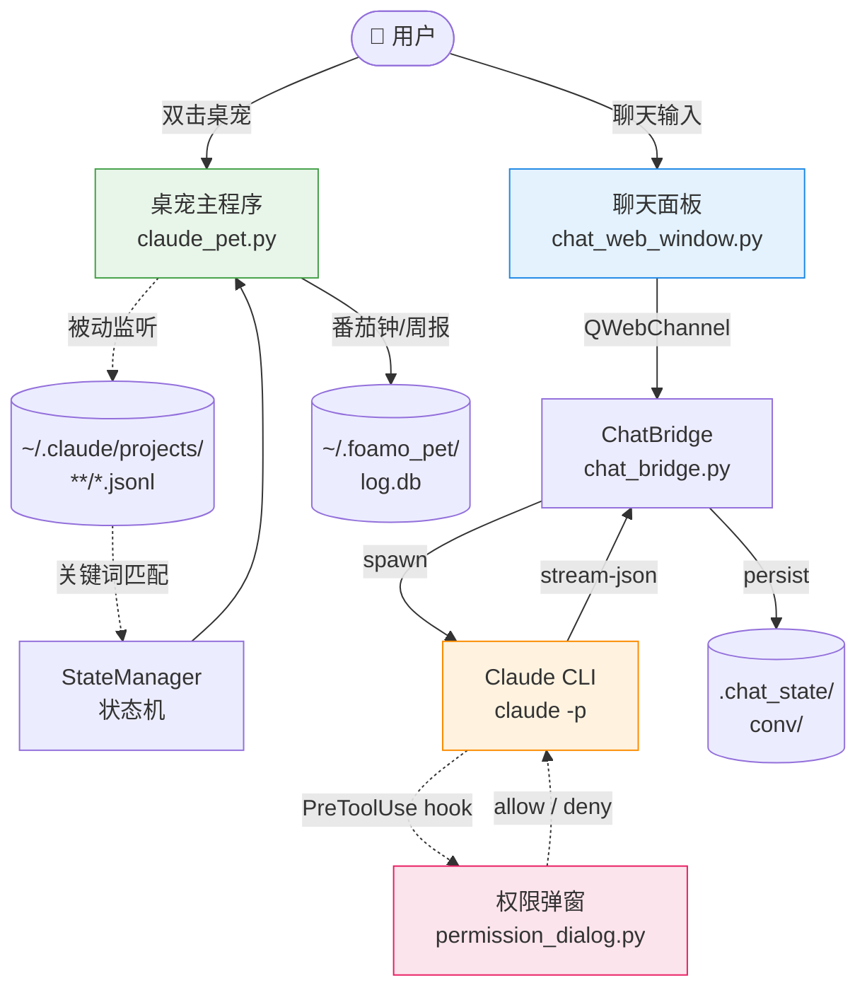

<div align="center">


# Claude Pet

**桌面悬浮的 Claude Code 陪伴 — 不打开 IDE 就能让 AI 改代码**

[](LICENSE)
[](https://www.python.org)
[](#-平台兼容)
[](https://github.com/zhangdoudougit/claude-pet/stargazers)
[](https://github.com/zhangdoudougit/claude-pet/commits)

<p></p>

</div>

---

## ✨ 这是什么

一个本地运行的 **PyQt6 桌面悬浮宠物**,把 [Claude Code](https://docs.claude.com/en/docs/claude-code/overview) 搬到你显示器右下角。两个独立但联动的能力:

1. **被动陪伴** —— 监听 `~/.claude/projects/*.jsonl`,根据你和 Claude Code 的对话关键词自动切换状态(担心 / 活泼 / 专注 / 得意),不发任何东西到 API。
2. **主动聊天** —— 桌宠双击呼出聊天面板,通过 `claude -p` 子进程跟 Claude Code 对话。**支持选定项目目录直接改代码**,不必打开 VSCode。

```
┌─────────────────────────────────────┐         ┌──────┐
│  聊天面板          严格 ▾  会话 ▾  ×  │         │      │
├─────────────────────────────────────┤         │      │
│ [你] 帮我读下 README.md 然后…       │         │ 桌宠 │
│                                     │         │      │
│ [⚙ Read][⚙ Read ✓]                  │         │      │
│ [AI] 看完了, 主要分三块…             │ ← 跟随 → │      │
└─────────────────────────────────────┘         └──────┘
```

> _项目名 `claude-pet`,桌宠角色 **泡沫 / foamo**(小丸子)。_

---

## 🌟 主要特性

### 🐾 桌宠本体

- 280×280 悬浮窗 + 系统托盘集成,支持多屏拖动 / 扒屏边探头
- 6 种状态对应 6 张 GIF(`idle / tender / focused / happy / worried / proud`)
- 关键词触发:`error → 担心`,`done → 活泼`,`git push → 专注`,等等
- 番茄钟、本周功劳簿(自动统计)
- 拖动会抖动 + 冒台词,扒到屏幕边会"探头"
- 可选 Live2D 立绘(放进 `assets_live2d/<角色名>/`)


### 💬 聊天面板

- **微信样式气泡** + Markdown 渲染 + 代码块高亮
- **Win11 Mica / Win10 Acrylic / 其他平台 Opacity** 三级毛玻璃自动降级
- **Spinner 思考动画**,先出头像再流式填内容
- **工具调用 chip**:连续工具压成一行胶囊,点击展开看 input + result
- **用户头像**自定义(`.chat_state/avatars/user.{png,jpg,...}`)
- **8 方向边缘拖拽**调大小


### 🎨 视觉系统 (v1.6)

聊天面板基于 Claude Design 输出重做了一版:

- **自绘 Win11 风 chrome**:32px 标题栏(icon + ☀/🌙 主题切换 + min/max/close)
- **双主题切换**:暖白克制版(浅色,沉静薄荷绿 accent) ↔ 暗色玻璃版(深色,青蓝 accent),持久化到 `.chat_state/theme`
- **侧栏重做**:暖色底,卡片白底 + 左侧 3px accent 竖条(选中态),二级行显示项目最近活动
- **StatusPill**:待机(灰) / 思考中(黄, 脉冲) / 在线(绿)
- **Composer 升级**:圆角卡片 + 工具行(📎 @ </>)+ 快捷键提示(↵ / ⇧↵)+ 主色实心发送按钮

### 🗂 多项目并发 (v1.5)

聊天面板从"贴桌宠的小窗"升级为独立的微信式一体窗。

| 区域 | 说明 |
|---|---|
| **左侧侧栏 (240px)** | 闲聊永远置顶,项目按最近活跃排序 |
| **右侧主区** | 当前选中卡片的对话气泡区 + 输入框 |
| **顶栏 +** | 添加项目:选目录 → 自定义简码 → 选 8 色之一 |

每张卡片对应一个独立的 `claude` 子进程,切换不打断后台对话。角标用三色单点表达状态:

- 🟡 **黄(脉冲)**:后台正在思考
- 🔴 **红(微闪)**:后台触发了权限请求,等你确认
- 🔵 **蓝(静态)**:后台回完了,你还没看

切到对应卡片时角标会自动清空。


### 📁 项目模式

- 会话菜单选 **[选择项目目录...]** → claude 的 cwd 切到该项目
- 让 claude 直接读 / 改代码,跟在 VSCode 里跑 `claude` 一样
- 每个项目**独立 session 和 history**,切回来能续聊

### 🔒 权限管理

- 头部下拉:**严格 / 自动接受改动 / 全放行(危险)**
- `PreToolUse` hook 配 PyQt6 弹窗:Claude 想用 Bash/Edit/Write 等会先弹确认
- 白名单跳过 Read/Glob 等纯读工具,不刷屏
- 只对聊天框启动的 claude 生效,**不污染** `~/.claude/settings.json`


### 🌏 国内可用

- 代理透传:`.chat_state/proxy` 文件 / 环境变量 `HTTPS_PROXY`
- 所有依赖能离线装(只需 `PyQt6`)

---

## 📸 Screenshots

> _截图陆续补完,以下是占位。_

| 桌宠形态 | 聊天面板 | 多项目 |
|---|---|---|
|  |  |  |

完整演示视频:


---

## 🏗 Architecture



完整状态机文档见 [`STATE_FLOW.html`](STATE_FLOW.html)(浏览器打开)。

---

## 📦 前置要求

- **Python 3.10+**
- **[Claude Code](https://docs.claude.com/en/docs/claude-code/quickstart)** 已安装并登录(`claude --version` 能跑)
- 国内用户:能跑通 Anthropic API 的代理 / 中转

---

## 🚀 Quick Start

### Windows

```bash
git clone https://github.com/zhangdoudougit/claude-pet.git
cd claude-pet
start.bat            # 首次自动 pip install PyQt6
```

不想看 cmd 黑窗:`start_silent.bat`(开机自启可以用这个)。
想要桌面快捷方式:`powershell -ExecutionPolicy Bypass -File install_shortcut.ps1`。

### macOS / Linux

```bash
git clone https://github.com/zhangdoudougit/claude-pet.git
cd claude-pet
pip install -r requirements.txt
python claude_pet.py
```

> macOS / Linux 没有 Mica/Acrylic,聊天面板会自动降级到半透明窗口(`opacity 0.96`),功能不受影响。

---

## 🌐 国内代理配置

第一次跑聊天框前,把代理写到 `.chat_state/proxy`(一行 URL):

```
http://127.0.0.1:7897
```

> 优先级:`.chat_state/proxy` > 环境变量 `HTTPS_PROXY` / `HTTP_PROXY`。
> 不需要代理就别建这个文件,代码会跳过注入。

---

## 🎮 使用

### 桌宠操作

| 操作 | 效果 |
|---|---|
| **左键拖动** | 移动位置(会记住,跨屏可拖) |
| **双击** | 开 / 关聊天面板 |
| **右键** | 菜单(番茄钟、切状态、聊天、置顶、退出) |
| **托盘图标** | 单击显示桌宠,右键完整菜单 |

### 聊天面板

| 区域 | 说明 |
|---|---|
| **头部** | `[严格 ▾]` 权限 · `[会话 ▾]` 模式切换 · `×` 关闭 |
| **气泡区** | 微信式上下气泡,助手回复支持 ```code``` 代码块 |
| **输入区** | Enter 发送 · Shift+Enter 换行 · Esc 关面板 |
| **边缘** | 八方向拖拉调大小 |

### 项目模式

`会话 ▾` → `📁 选择项目目录...` → 选你想改的项目 → 标题切到 "**<项目名>**" → 直接说 "读 README.md / 改 main.py 第 30 行"。

每个项目独立 session 和 history,切回来能续聊。

### 权限模式

| 模式 | 行为 |
|---|---|
| **严格** | Bash / Edit / Write 等敏感工具弹 PyQt6 确认窗,Read / Glob 纯读放行 |
| **自动接受改动** | Edit / Write 类放行,Bash 仍弹 |
| **全放行** | 危险!Claude 可以无确认跑任何命令。只在你完全信任当前项目时用 |

---

## ❓ FAQ

**Q: 国内没代理能跑吗?**

Claude Code CLI 自己需要能通 Anthropic API。如果直连不通,需要配代理(见上面 [国内代理配置](#-国内代理配置))。Claude Pet 本身只是壳子,不直接调 API——代理给到 `claude` 子进程就行。

**Q: 权限弹窗一直弹很烦,怎么改?**

三档可选,聊天面板头部下拉切换:
- **严格**(默认):Bash / Edit / Write 等敏感工具都弹
- **自动接受改动**:Edit / Write 放行,Bash 仍弹
- **全放行**:都不弹(危险,只在你信任当前项目时用)

如果想永久跳过特定工具,改 `permission_dialog.py` 顶部的 `SKIP_TOOLS` 白名单。

**Q: 多个项目同时跑,资源占用如何?**

每个项目对应独立 `claude` 子进程,idle 时大约 30~50MB / 进程。建议同时打开不超过 5~6 个。切换面板不打断后台对话,后台跑完会用蓝色角标提示"有未读"。

**Q: macOS / Linux 毛玻璃为什么没生效?**

Mica / Acrylic 是 Windows 独占 API。其他平台自动降级到 opacity 0.96 的半透明窗口,功能完整,只是没有原生模糊效果。

**Q: 怎么完全卸载 / 清空数据?**

删项目目录 + 清三处本地数据:

```bash
# 1. 项目根目录下的会话状态(代理/历史/项目列表)
rm -rf claude-pet/.chat_state/

# 2. 番茄钟和周报数据库
rm -rf ~/.foamo_pet/

# 3. Windows QSettings 注册表(可选)
# 注册表路径: HKCU\Software\DogeFoamo\Claude Pet
# macOS:    ~/Library/Preferences/com.DogeFoamo.Claude Pet.plist
```

**Q: 想换桌宠形象怎么办?**

两种方式:
- **简单**:替换 `assets/` 下 6 张状态 GIF(`idle / tender / focused / happy / worried / proud`),程序会自动 reload
- **Live2D**:把模型(含 `.model3.json` + `.moc3` + 贴图)放到 `assets_live2d/<角色名>/`,启动后在右键菜单选

详见 [`REPLACE_ASSETS.md`](REPLACE_ASSETS.md)。

---

## 🖥 平台兼容

| 平台 | 桌宠 | 聊天面板 | 毛玻璃 |
|---|---|---|---|
| Windows 11 | ✅ | ✅ | ✅ Mica |
| Windows 10 | ✅ | ✅ | ✅ Acrylic |
| macOS | ✅ | ✅ | Opacity (无原生模糊) |
| Linux | ✅ | ✅ | Opacity |

---

## 🛠 自定义

### 改关键词 / 台词

`claude_pet.py` 顶部:

- `KEYWORD_RULES` —— 正则规则,触发哪个状态
- `LINES` —— 各状态台词列表

修完保存即可,运行中也能 reload。

### 换角色资源

见上面 FAQ "想换桌宠形象怎么办?" 或 [`REPLACE_ASSETS.md`](REPLACE_ASSETS.md)。

### 加快捷键 / 自定义命令

在 `mcp_manager.py` 注册 MCP server,聊天面板会自动识别。

---

## 🗺 路线图

- [ ] 多角色皮肤一键切换(`assets/<角色>/...`)
- [ ] 一键生成 PyInstaller exe
- [ ] 工具调用 chip 加 Bash 命令的语法高亮
- [ ] 权限"本会话允许"持久化
- [ ] 聊天面板移动端响应式
- [ ] 国际化(英文 README + i18n string table)

---

## 🤝 贡献

PR 欢迎,详细规则见 [CONTRIBUTING.md](CONTRIBUTING.md)。

提 bug 请贴:
- `.chat_state/debug.log` 末尾若干行
- 平台 + Python 版本
- 复现步骤

---

## 📜 License

代码 [MIT](LICENSE) © 2026 zhangdoudougit。

> 桌宠角色 **泡沫 / foamo**(小丸子)由豆哥本人塑造,角色形象和台词版权保留,**fork 项目时角色可替换为你自己的**(`assets/` GIF 换掉即可)。

---

## 🙏 致谢

- [Claude Code](https://docs.claude.com/en/docs/claude-code/overview) —— 这个项目的对面那一半
- [PyQt6 FlowLayout 示例](https://doc.qt.io/qt-6/qtwidgets-layouts-flowlayout-example.html) —— 工具 chip 排版灵感
- [Shields.io](https://shields.io)、[Mermaid](https://mermaid.js.org/) —— README 美化
- 在角落里探头的本泡沫

---

<div align="center">

_本泡沫已上线 · 豆哥晚上好_ 🫧

</div>
